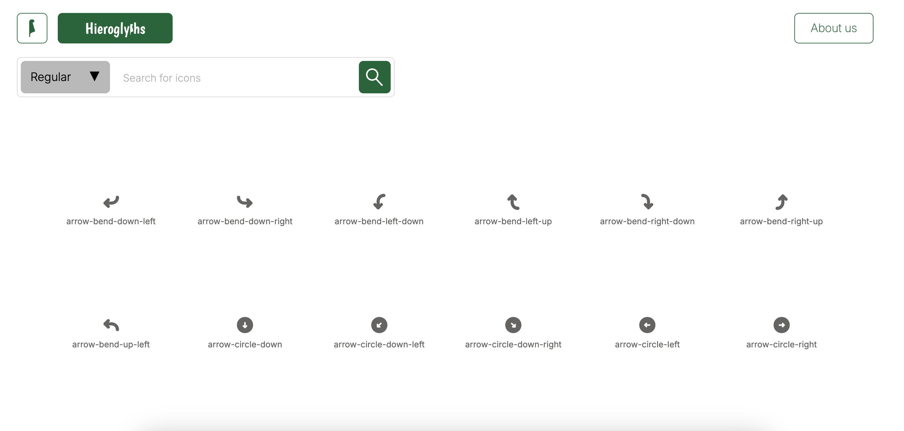

# Plugins Hieroglyphs.io

[](LICENSE)  

This project allows me to create npm plugins for their reuse by other developers.   

## Description  

This project is more complex than it seems since it uses a CI system which verifies the code through a series of tests, and automatically deploys the plugins on [npmjs.com](npmjs.com). These are svg icons that I designed and which will be distributed on a website to allow developers to easily integrate them into their own website.  



## Table of Contents

- [Getting Started](#Getting-Started)
- [Contributing](#Contributing)
- [License](#License)  

## Getting Started  

```bash
git clone https://github.com/HaDock404/app-plugin-hieroglyphs.git
cd app-plugin-hieroglyphs
npm install
```  

## Contributing

Pull requests are welcome. For major changes, please open an issue first
to discuss what you would like to change.

Please make sure to update tests as appropriate.

## License  

This project is licensed under the MIT License - see the [LICENSE](./LICENSE) file for details.
